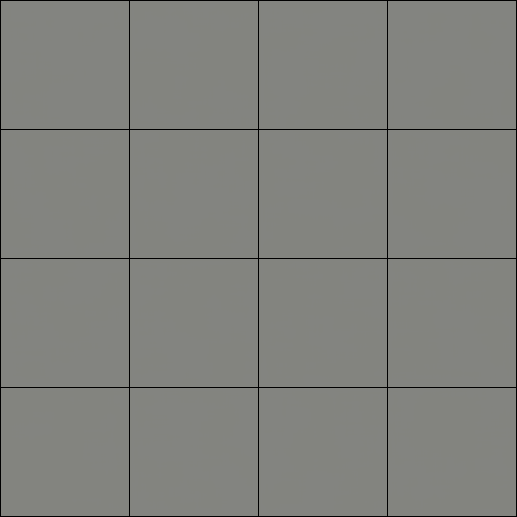

# FastGAN Image Generation for Ukiyo-e Artworks

A PyTorch implementation of **FastGAN** (Liu et al., 2021) trained on the Ukiyo-e dataset.

## Project Structure

```
.
├── train.py            # Training entry point
├── evaluation.py       # FID & Inception Score evaluation (saves eval_results.json)
├── config/
│   └── default.yaml    # All hyperparameters and paths
├── src/
│   ├── models/
│   │   ├── generator.py      # Generator (InitLayer, UpBlock, SLEBlock)
│   │   └── discriminator.py  # Discriminator with reconstruction loss
│   ├── dataset/
│   │   └── dataset.py        # Image dataloader
│   ├── engine/
│   │   └── trainer.py        # FastGANTrainer (train loop, EMA, checkpointing)
│   └── utils/
│       ├── diffaugment.py    # DiffAugment (color / translation / cutout)
│       ├── losses.py         # GAN loss helpers
│       └── plot_results.py   # Loss curves + generated image grid plots
├── data/
│   └── Ukiyo_e/              # Training images
└── outputs/
    ├── images/fastgan/       # Sample grids saved during training
    ├── logs/fastgan/         # TensorBoard event files
    ├── weights/
    │   ├── checkpoints/      # Periodic checkpoints (ckpt_epoch_XXXX.pth)
    │   ├── generator.pth     # Final generator weights
    │   └── generator_ema.pth # EMA-smoothed weights (preferred for eval)
    ├── epoch_loss_g_fastgan.csv  # Per-epoch generator loss (exported from TensorBoard)
    ├── epoch_loss_d_fastgan.csv  # Per-epoch discriminator loss (exported from TensorBoard)
    ├── loss_curves.png           # Stacked G/D loss plot (square, 300 dpi)
    ├── generated_grid.png        # 3×3 generated image grid (square, 300 dpi)
    └── eval_results.json         # FID & IS scores
```

## Training Progress



## Quick Start

### Install dependencies

```bash
uv sync
```

### Train

```bash
uv run train.py
```

### Evaluate (FID & IS)

Loads `generator_ema.pth` by default and saves scores to `outputs/eval_results.json`.

```bash
uv run evaluation.py
```

### Plot loss curves & generated images

```bash
uv run .\src\utils\plot_results.py
```

Outputs:
- `outputs/loss_curves.png` — G and D epoch losses stacked vertically
- `outputs/generated_grid.png` — 3×3 grid of images sampled from `generator_ema.pth`

### Monitor training

```bash
tensorboard --logdir outputs/logs
```

## Key Configuration (`config/default.yaml`)

| Parameter | Default | Description |
|---|---|---|
| `image_size` | 256 | Output resolution (64 / 128 / 256) |
| `z_dim` | 256 | Latent noise dimension |
| `nfc_base` | 32 | Channel multiplier |
| `batch_size` | 16 | Training batch size |
| `num_epochs` | 800 | Total epochs |
| `lr` | 2e-4 | Adam learning rate |
| `recon_lambda` | 1.0 | Reconstruction loss weight |
| `diffaug_policy` | `translation,cutout` | DiffAugment policies |
| `use_amp` | true | Mixed-precision training |
| `use_ema` | true | Exponential moving average of G weights |
| `checkpoint_every` | 50 | Save full checkpoint every N epochs |

## Requirements

- Python ≥ 3.12
- PyTorch ≥ 2.10 (CUDA 13.0)
- See `pyproject.toml` for full dependency list